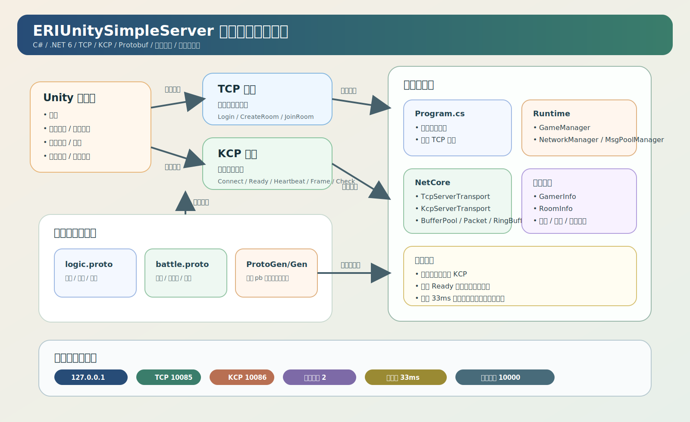

# ERIUnitySimpleServer

这是一个基于 C# / .NET 6 的轻量级联机服务端示例，面向 Unity 对战场景，采用 `TCP + KCP + Protobuf` 的双通道通信方案

- `TCP` 负责登录、大厅、创建房间、加入房间等逻辑层消息。
- `KCP` 负责战斗连接、准备、心跳、帧同步、校验等实时对战消息。
- `Protobuf` 负责逻辑协议和战斗协议的消息定义与序列化。

## 技术栈

### 运行时与语言

- `C#`
- `.NET 6` 控制台程序
- `async/await + Task` 用于战斗帧循环

### 网络通信

- `TCP`
  用于登录、创建房间、加入房间等大厅逻辑
- `KCP`
  用于战斗连接、心跳、准备、帧同步、校验
- 自定义传输层封装
  位于 `NetCore/Transports`

### 协议与序列化

- `Google.Protobuf`
- `.proto` 协议文件位于 `ProtoGen/Proto`
- 生成代码位于 `ProtoGen/Gen`

### 项目结构

- `Program.cs`
  服务端入口，负责初始化管理器、启动 TCP 服务、输出日志
- `Runtime/`
  业务管理层，包括玩家、房间、消息池、日志、网络调度
- `NetCore/`
  网络基础设施，包括 TCP/KCP 传输、KCP 工具、缓冲区与包处理
- `ProtoGen/`
  协议定义与 Protobuf 代码生成
- `Battle/`
  战斗侧配置，例如帧间隔和最大帧数
- `Google.Protobuf/`
  Protobuf 运行时代码

## 核心流程

1. 服务启动后初始化 `GameManager`、`MsgPoolManager`、`NetworkManager`、`LogManager`。
2. 客户端通过 `TCP` 发起登录。
3. 客户端通过 `TCP` 创建房间或加入房间。
4. 房间人数满足条件后启动 `KCP` 服务。
5. 客户端通过 `KCP` 建立战斗连接并发送准备消息。
6. 所有玩家准备完成后，服务端启动帧同步循环。
7. 服务端按固定间隔广播权威帧，并处理校验消息。

## 架构设计图

## 适用场景

- Unity 联机原型验证
- 帧同步对战 Demo
- TCP 大厅 + KCP 战斗 的服务端拆分示例
- Protobuf 协议驱动的轻量服务端样例
